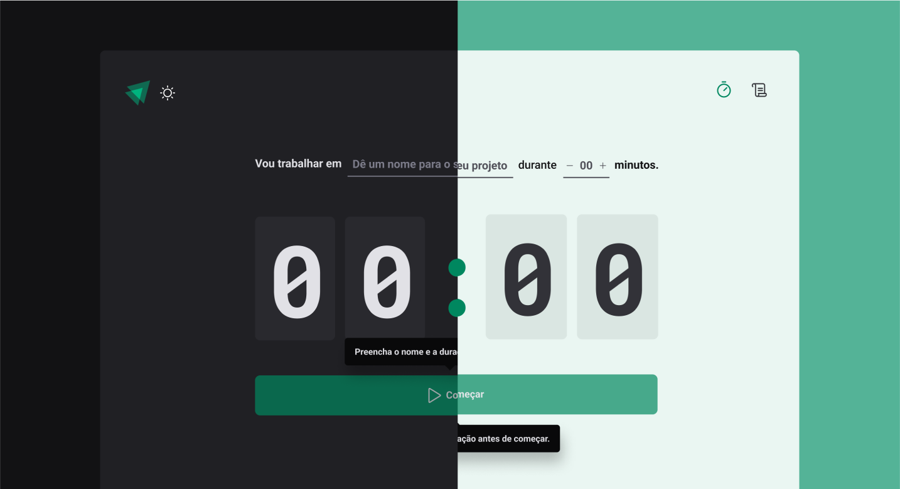

<h1 align="center">
  
</h1>

<h3 align="center">
 Timer
</h3>


<p align="center">
  <a href="#-about-the-project">Sobre o projecto</a>&nbsp;&nbsp;&nbsp;|&nbsp;&nbsp;&nbsp;
  <a href="#-technologies">Tecnologia</a>&nbsp;&nbsp;&nbsp;|&nbsp;&nbsp;&nbsp;
  <a href="#-getting-started">Mete uma Estrela</a>&nbsp;&nbsp;&nbsp;|&nbsp;&nbsp;&nbsp;
  <a href="#-how-to-contribute">Como contibuir </a>&nbsp;&nbsp;&nbsp;|&nbsp;&nbsp;&nbsp;
  <a href="#-license">License</a>
</p>

## ✅ Sobre o projecto


## 🚀 Technologies

Tecnologia utilizada

- [React JS](https://pt-br.reactjs.org/)
- [Vite JS](https://vitejs.dev/)
- [TypeScript](https://www.typescriptlang.org/)
- [Styled Components](https://styled-components.com/)
- [Axios](https://axios-http.com/)

## 💻 Getting started

**Clone the project and access the folder**

```bash
$ git clone https://github.com/vilmarsitiodigital/github-blog.git && cd github-blog
```

**Follow the steps below**

```bash
# Install the dependencies
$ npm i

# To finish, run
$ npm run dev

# Well done, project is started!
```

## 🤔 How to contribute

**Make a fork of this repository**

```bash
# Fork using GitHub official command line
# If you don't have the GitHub CLI, use the web site to do that.

$ gh repo fork vilmarsitiodigital/github-blog
```

**Follow the steps below**

```bash
# Clone your fork
$ git clone your-fork-url && cd github-blog

# Create a branch with your feature
$ git checkout -b my-feature

# Make the commit with your changes
$ git commit -m 'Feature: My new feature'

# Send the code to your remote branch
$ git push origin my-feature
```

After your pull request is merged, you can delete your branch

## 📝 License

Este projecto está sobre lincensa MIT License - see the [LICENSE](LICENSE) .

---
## Anotações 
### Layout da Rota 
Para definir o que não muda durante a renderização do app
Se a gente tiver dois Layout em a nossa routes vai ser assim 
Primeiro criar o component layout 
```tsx
  import { Outlet } from 'react-router-dom';
  
  export function DefaultLayout () {
    return (
    // Component de fault que pode ser o Header da aplicação 
      <Header />
    // E por fim o Outlet para dizer onde deve ser renderizado o component 
    <Outlet />
    )
  }
```

```tsx
  <Routes>
      <Route path="/" element={<DefaultLayout />}>
        <Route path="/" element={<Home />} />
        <Route path="/history" element={<History />} />
       <Route/>
       <Route path="/admin" element={<DefaultLayout />}>
        <Route path="/" element={<Home />} />
        <Route path="/history" element={<History />} />
       <Route/>
  </Routes>
```

Logo as rotas que eu terei são :
```bash
http://localhost:3000/
http://localhost:3000/history

http://localhost:3000/adimn
http://localhost:3000/admin/history
```

# Modo controlled e uncontrolled 

**Controlled** - Mater em em tempo real a informação do form 
**Uncontrolled** - Não mate as atualizações em real time mais tem mais fluidez 

**Prop Drilling** - Quando a gente tem muitos propriedades Apenas para
comunicação entre componente para evitar isso a gente usa **ContextAPI** permite
compartilhar informações entre vários componentes ao mesmo tempo ao nosso tempo 

## useReducer

Ele consegue agregar todas action que um estado tem , resumindo ele pega todos os methods de um estado e agrega.
Made with 💚 by Vilmar Batista 🤝 [See my linkedin](https://www.linkedin.com/in/vilmarbatista/)